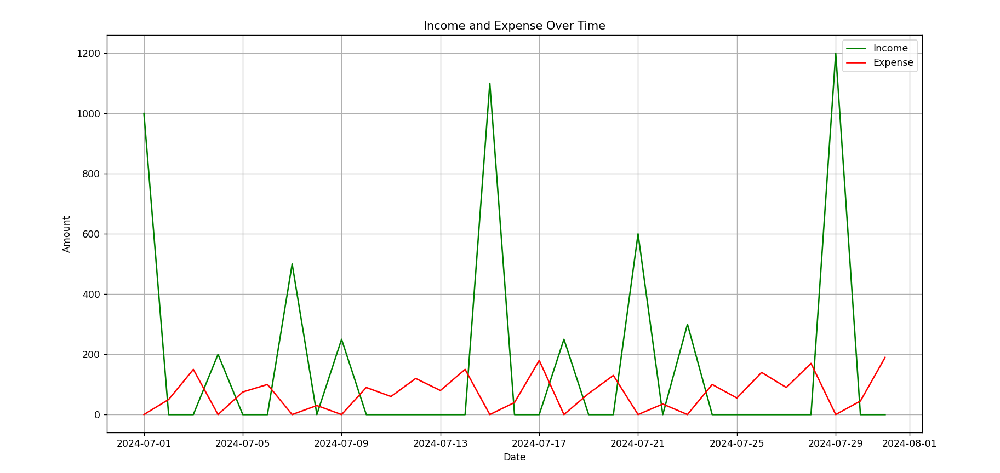
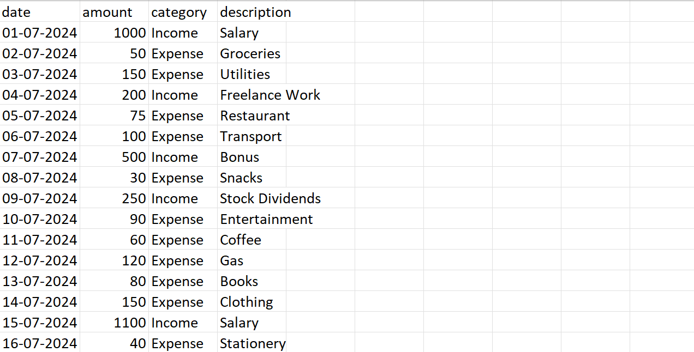

# 💸 Personal Finance Tracker

This is a **Personal Finance Tracker** that allows users to:
- ✅ Add Income/Expense transactions.
- ✅ View transactions between a specific date range.
- ✅ See a summary of Total Income, Total Expenses, and Savings.
- ✅ Plot transactions as a graph (Income vs Expense) over time.

The project is built using **Python** and uses:
- **Pandas** for data manipulation.
- **Matplotlib** for data visualization.
- **CSV Files** for storing financial data.

---

## 🚀 Features

### 📅 1. Add New Transaction
- You can add a new transaction with:
  - **Date**: (e.g., 01-07-2024)
  - **Amount**: (e.g., 1000)
  - **Category**: Income or Expense
  - **Description**: (e.g., Salary, Grocery, Transport)

### 💰 2. View Transactions
- You can view all transactions within a specific date range.
- The output will show:
  - **Date**
  - **Amount**
  - **Category**
  - **Description**

### 📊 3. Plot Transactions
- You can plot Income vs Expense over time.
- The graph will show:
  - ✅ **Green Line** → Income
  - ✅ **Red Line** → Expense
- It helps you track your financial health over time.

### 📈 4. Summary
- The summary shows:
  - ✅ Total Income
  - ✅ Total Expenses
  - ✅ Savings

---

## 💻 Installation

1. **Clone the Repository:**
```bash
https://github.com/dhruveshpatel25/Personal-Finance-Tracker
cd personal-finance-tracker
```

2. **Install Dependencies:**
```bash
pip install pandas
pip install matplotlib
```

3. **Run the Application:**
```bash
python main.py
```

---

## 📊 Usage

### ➕ Add Transaction
```plaintext
1. Add new transaction
2. View transactions
3. Exit
Enter your choice: 1
```

- Enter Date: `01-07-2024`
- Enter Amount: `1000`
- Enter Category: `I` (for Income) or `E` (for Expense)
- Enter Description: `Salary`

✅ Transaction added successfully.


### 📅 View Transactions
```plaintext
Enter your choice: 2
Enter the start date (DD-MM-YYYY): 01-07-2024
Enter the end date (DD-MM-YYYY): 31-07-2024
```
- It will show all transactions between these dates.
- It will also show a summary like:
```plaintext
Total Income: 5400.00
Total Expense: 2150.00
Savings: 3250.00
```

### 📊 Plot Transactions
- After viewing transactions, it will ask:
```plaintext
Do you want to plot the transactions? (y/n): y
```
- If you enter `y`, it will show a graph like this:



---

## 📂 File Structure
```plaintext
personal-finance-tracker
│
├── data_entry.py     # Handles user input for date, amount, category, etc.
├── main.py           # Main logic of the application
├── finance_data.csv  # Stores all transactions in CSV
├── README.md         # This file
├── images/           # Folder to store images for README
```

---

## 📸 Screenshots

### ✅ View Transactions


### ✅ Plot Transactions


---

## 📜 License
This project is licensed under the **MIT License**. You can use, modify, and distribute this project freely.

---

## 🤝 Contributing
If you want to improve this project, feel free to fork the repository and raise a pull request. 😊

---

## 📬 Contact
- **Author**: Dhruvesh Patel
- **GitHub**: [https://github.com/dhruveshpatel25](https://github.com/dhruveshpatel25)
- **Email**: dhruu25@gmail.com

---

## ⭐ Don't forget to leave a star ⭐ if you found this project useful!

